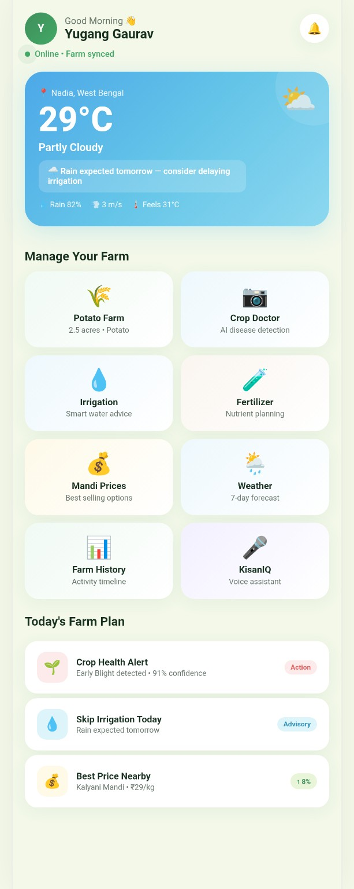
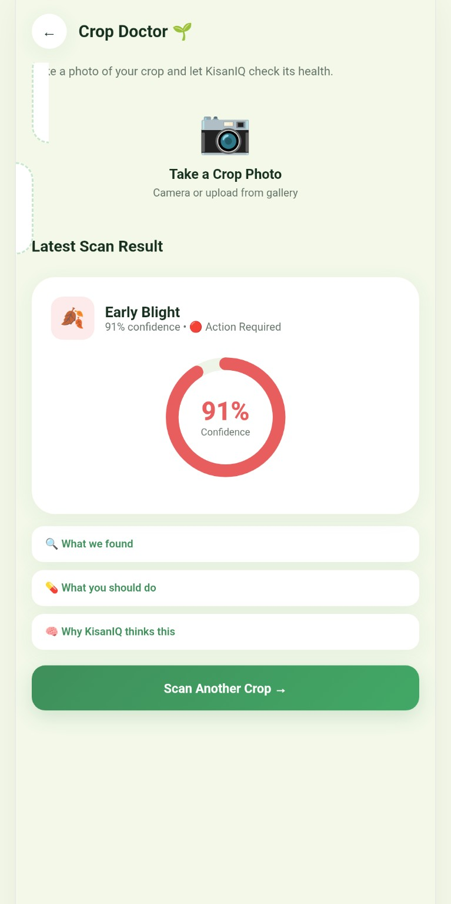
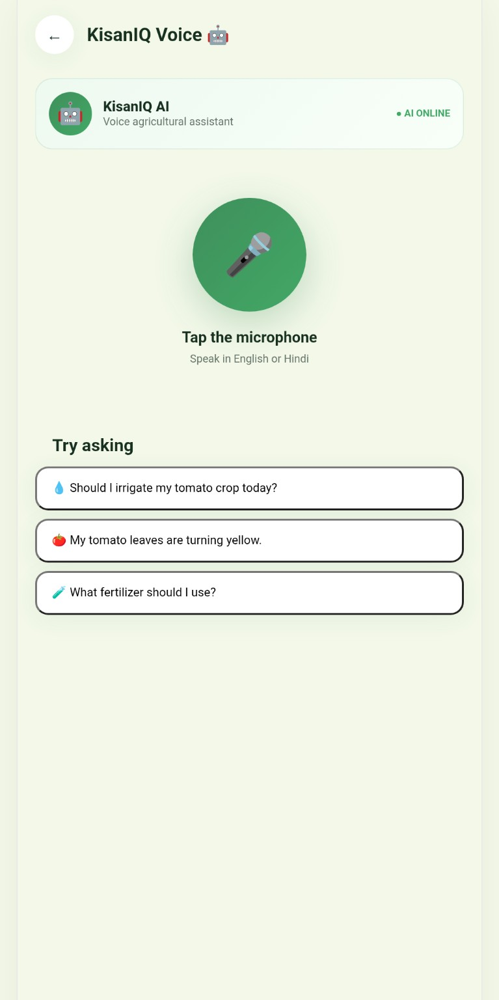
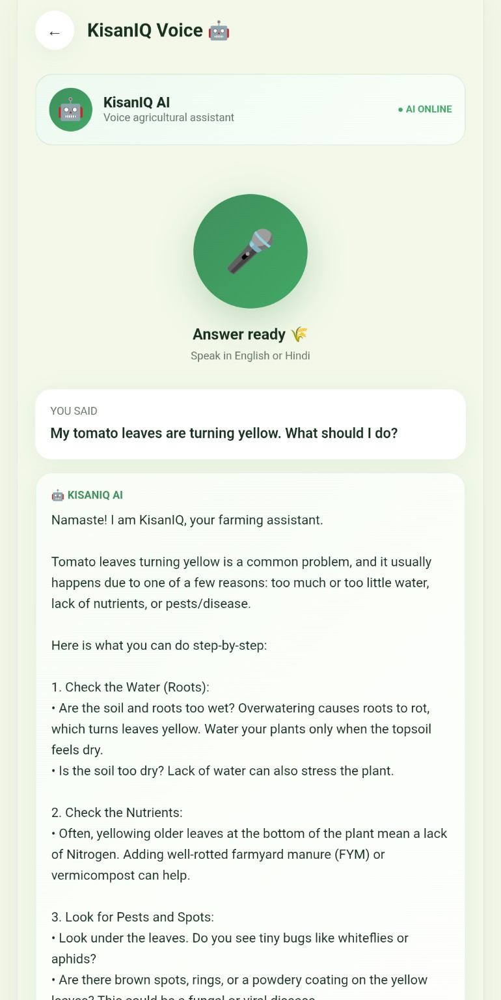

<h1 align="center">🌾 KisanIQ</h1>

<h3 align="center">AI-Powered Smart Crop Advisory & Farm Resource Optimization Platform</h3>

<p align="center">
  Empowering smallholder farmers with accessible AI-powered agricultural intelligence for smarter crop decisions, better resource utilization, and better farm outcomes.
</p>

<p align="center">
  <a href="https://yuganggaurav.github.io/KisanIQ/"><strong>🚀 Live Demo</strong></a>
  &nbsp;•&nbsp;
  <a href="https://github.com/YugangGaurav/KisanIQ"><strong>💻 Source Code</strong></a>
  &nbsp;•&nbsp;
  <a href="https://kisaniq.onrender.com"><strong>⚙️ Backend</strong></a>
</p>

---

<h2>🏆 Hackathon</h2>

<h3>IEMHACKS 4.0 — Track 03: AGRITECH</h3>

<table>
<tr><td><strong>Problem ID</strong></td><td>IEM24-AG-01</td></tr>
<tr><td><strong>Problem Statement</strong></td><td>Smart Crop Advisory & Farm Resource Optimization System for Smallholder Farmers</td></tr>
<tr><td><strong>Category</strong></td><td>Software / Hardware</td></tr>
<tr><td><strong>Difficulty</strong></td><td>Intermediate</td></tr>
</table>

---

<h2>🎯 Problem Statement</h2>

<p>
Small and marginal farmers face unpredictable yields due to poor access to real-time crop-health monitoring, inefficient water and fertilizer use, and generic agricultural guidance. Many farmers also lose income because they lack visibility into real-time mandi and market prices, making it difficult to decide when and where to sell.
</p>

<p>
The challenge calls for a smart advisory platform that combines image, weather and soil information to provide real-time, hyperlocal and crop-specific recommendations on irrigation, fertilization and pest control, along with live market-price comparisons. The solution should also remain accessible to farmers through simple interfaces and voice or SMS-based advisory channels.
</p>

---

<h2>💡 Our Solution</h2>

<p>
<strong>KisanIQ</strong> is an AI-powered agricultural decision-support platform designed to make modern agricultural intelligence easier to access and understand.
</p>

<p>
Instead of requiring farmers to search through multiple complicated resources, KisanIQ provides a unified interface where users can interact with an AI agricultural assistant using text, voice and crop images.
</p>

<p>
The current prototype focuses on two important and high-impact capabilities from the problem statement:
</p>

<ul>
<li><strong>AI Crop Doctor:</strong> Image-based crop and plant problem analysis.</li>
<li><strong>AI Voice Assistant:</strong> Natural voice-based interaction with an agricultural assistant.</li>
</ul>

<p>
The architecture is designed so that additional agricultural data sources such as weather, soil information, irrigation data and market prices can be integrated into the advisory engine as the platform evolves.
</p>

---

<h2>✨ Key Features</h2>

<h3>📸 1. AI Crop Doctor</h3>

<p>
Farmers can upload a photograph of a crop or plant. KisanIQ sends the image to its backend, where Google Gemini's multimodal capabilities are used to analyze visible crop-health problems.
</p>

<p>The analysis can include:</p>

<ul>
<li>Crop or plant identification</li>
<li>Possible disease or pest issue</li>
<li>Possible nutrient deficiency</li>
<li>Visible symptoms</li>
<li>Confidence level</li>
<li>Recommended actions</li>
<li>Preventive measures</li>
</ul>

<p>
The AI instructions are designed to avoid presenting uncertain image analysis as a guaranteed diagnosis.
</p>

<h3>🎙️ 2. AI Voice Assistant</h3>

<p>
KisanIQ provides a voice-based agricultural assistant so users can ask questions naturally without depending entirely on typing.
</p>

<p>For example, a farmer can ask:</p>

<blockquote>
My tomato leaves are turning yellow. What could be the reason and what should I do?
</blockquote>

<p>
The voice interaction is designed to make agricultural assistance more accessible and natural, particularly for users who may prefer speaking over typing.
</p>

<h3>💬 3. Conversational Agricultural Assistant</h3>

<p>
Users can ask agricultural questions in natural language and receive AI-generated guidance.
</p>

<p>The assistant can help with topics such as:</p>

<ul>
<li>Crop-related problems</li>
<li>Plant symptoms</li>
<li>Crop care</li>
<li>General farming practices</li>
<li>Preventive measures</li>
<li>Agricultural decision support</li>
</ul>

<h3>🧠 4. AI-Powered Agricultural Reasoning</h3>

<p>
Google Gemini is used as the core AI engine for natural-language understanding, conversational responses and multimodal crop-image analysis.
</p>

<h3>📱 5. Farmer-Friendly Web Interface</h3>

<p>
The platform is designed around simple interactions, clear navigation and direct access to agricultural AI capabilities.
</p>

---

<h2>🎯 Problem Statement Alignment</h2>

<table>
<tr>
<th>Problem Statement Requirement</th>
<th>KisanIQ Status</th>
</tr>
<tr>
<td>Crop disease / problem detection from images</td>
<td>✅ Implemented</td>
</tr>
<tr>
<td>Crop-health analysis</td>
<td>✅ Implemented</td>
</tr>
<tr>
<td>Voice-based advisory</td>
<td>✅ Implemented</td>
</tr>
<tr>
<td>AI agricultural assistant</td>
<td>✅ Implemented</td>
</tr>
<tr>
<td>Crop-specific agricultural guidance</td>
<td>✅ AI-assisted</td>
</tr>
<tr>
<td>Personalized fertilizer recommendations</td>
<td>🔄 Planned extension</td>
</tr>
<tr>
<td>Personalized irrigation scheduling</td>
<td>🔄 Planned extension</td>
</tr>
<tr>
<td>Weather integration</td>
<td>🔄 Planned extension</td>
</tr>
<tr>
<td>Soil-health integration</td>
<td>🔄 Planned extension</td>
</tr>
<tr>
<td>Mandi / market-price comparison</td>
<td>🔄 Planned extension</td>
</tr>
<tr>
<td>SMS / IVR advisory</td>
<td>🔄 Planned extension</td>
</tr>
<tr>
<td>Optional IoT soil sensors</td>
<td>🔄 Planned hardware extension</td>
</tr>
</table>

<p>
<strong>Transparency:</strong> Features marked as planned are not represented as fully implemented in the current prototype. They form the next stage of KisanIQ's development roadmap.
</p>

---

<h2>🏗️ System Architecture</h2>

<pre>
                         ┌──────────────────────────┐
                         │         FARMER           │
                         │                          │
                         │   Text • Voice • Image   │
                         └────────────┬─────────────┘
                                      │
                                      ▼
                         ┌──────────────────────────┐
                         │        KisanIQ           │
                         │        Frontend          │
                         │                          │
                         │ HTML • CSS • JavaScript  │
                         └────────────┬─────────────┘
                                      │
                                      │ REST API
                                      ▼
                         ┌──────────────────────────┐
                         │     KisanIQ Backend      │
                         │                          │
                         │    Node.js + Express     │
                         └────────────┬─────────────┘
                                      │
                                      │ API Request
                                      ▼
                         ┌──────────────────────────┐
                         │      Google Gemini       │
                         │                          │
                         │     Text + Vision AI     │
                         └────────────┬─────────────┘
                                      │
                                      ▼
                         ┌──────────────────────────┐
                         │   Agricultural Insight   │
                         │                          │
                         │ Analysis + Recommendation│
                         └──────────────────────────┘
</pre>

---

<h2>🔄 AI Crop Analysis Workflow</h2>

<pre>
Farmer
  │
  ▼
Upload Crop Image
  │
  ▼
KisanIQ Frontend
  │
  ▼
POST /api/analyze-crop
  │
  ▼
Node.js + Express Backend
  │
  ▼
Google Gemini Multimodal AI
  │
  ├── Crop / Plant
  ├── Possible Issue
  ├── Symptoms
  ├── Confidence
  ├── Recommended Actions
  └── Prevention
  │
  ▼
KisanIQ Results
</pre>

---

<h2>🎙️ Voice Assistant Workflow</h2>

<pre>
Farmer speaks
      │
      ▼
Voice Input
      │
      ▼
KisanIQ Voice Assistant
      │
      ▼
Agricultural Query
      │
      ▼
Backend API
      │
      ▼
Google Gemini
      │
      ▼
AI Response
      │
      ▼
Clean, Farmer-Friendly Output
</pre>

---

<h2>🤖 Artificial Intelligence</h2>

<p>KisanIQ uses <strong>Google Gemini</strong> as its core AI service.</p>

<table>
<tr><th>AI Capability</th><th>Purpose</th></tr>
<tr><td>Natural Language Understanding</td><td>Understand farmer questions and generate useful responses</td></tr>
<tr><td>Multimodal Vision</td><td>Analyze uploaded crop and plant images</td></tr>
<tr><td>Conversational AI</td><td>Provide natural-language agricultural assistance</td></tr>
<tr><td>Structured Recommendations</td><td>Convert AI analysis into readable, actionable sections</td></tr>
</table>

---

<h2>🧠 AI Safety & Reliability</h2>

<p>
Agricultural recommendations can affect real-world farming decisions. KisanIQ therefore treats AI output as decision-support information rather than guaranteed professional diagnosis.
</p>

<p>The crop-analysis system is designed to:</p>

<ul>
<li>Avoid claiming certainty when the image is unclear.</li>
<li>Avoid inventing symptoms that are not supported by the image.</li>
<li>Provide confidence information.</li>
<li>Present possible causes instead of guaranteed diagnoses.</li>
</ul>

<p>
Users should verify important crop-health, pesticide, fertilizer and farm-management decisions with qualified agricultural professionals and trusted local agricultural resources.
</p>

---

<h2>🛠️ Technology Stack</h2>

<h2>Frontend</h2>

<ul>
<li>HTML5</li>
<li>CSS3</li>
<li>JavaScript</li>
<li>Browser Web APIs</li>
</ul>

<h2>Backend</h2>

<ul>
<li>Node.js</li>
<li>Express.js</li>
<li>REST APIs</li>
<li>Multer</li>
<li>CORS</li>
<li>dotenv</li>
</ul>

<h2>Artificial Intelligence</h2>

<ul>
<li>Google Gemini API</li>
<li>Gemini multimodal image analysis</li>
<li>Natural-language AI</li>
</ul>

<h2>Development & Deployment</h2>

<ul>
<li>Git</li>
<li>GitHub</li>
<li>GitHub Pages</li>
<li>Render</li>
</ul>

---

<h2>🌐 Live Application</h2>

<table>
<tr><td><strong>🚀 Frontend</strong></td><td><a href="https://yuganggaurav.github.io/KisanIQ/">https://yuganggaurav.github.io/KisanIQ/</a></td></tr>
<tr><td><strong>⚙️ Backend</strong></td><td><a href="https://kisaniq.onrender.com">https://kisaniq.onrender.com</a></td></tr>
<tr><td><strong>💻 GitHub</strong></td><td><a href="https://github.com/YugangGaurav/KisanIQ">https://github.com/YugangGaurav/KisanIQ</a></td></tr>
</table>

---

<h2>📸 Product Screenshots</h2>

<h3>Screenshot 1 — KisanIQ Dashboard</h3>



<h3>Screenshot 2 — AI Crop Doctor / Camera Analysis</h3>



<h3>Screenshot 3 — Voice Assistant</h3>



<h3>Screenshot 4 — AI Agricultural Assistant</h3>



---

<h2>📂 Project Structure</h2>

<pre>
KisanIQ/
│
├── backend/
│   ├── server.js
│   ├── package.json
│   ├── package-lock.json
│   └── ...
│
├── screenshots/
│   ├── dashboard.png
│   ├── crop-doctor.png
│   ├── voice-assistant.png
│   └── ai-assistant.png
│
├── index.html
├── .gitignore
└── README.md
</pre>

---

<h2>⚙️ Local Setup</h2>

<h3>1. Clone the repository</h3>


```bash
git clone https://github.com/YugangGaurav/KisanIQ.git
cd KisanIQ
```


<h3>2. Install backend dependencies</h3>


```bash
cd backend
npm install
```


<h3>3. Configure the Gemini API key</h3>

<p>
Create a <code>.env</code> file inside the <code>backend</code> directory.
</p>


```env
GEMINI_API_KEY=YOUR_GEMINI_API_KEY
```


<h3>4. Start the backend</h3>


```bash
npm start
```


<h3>5. Run the frontend</h3>

<p>
Open the frontend using a local development server such as VS Code Live Server or another static HTTP server.
</p>

---

<h2>🔐 Security</h2>

<p>
The Gemini API key is stored using environment variables and should never be hard-coded into the public source code.
</p>

<p>
Do not commit <code>.env</code> files or secret credentials to GitHub.
</p>

<p>
For production deployment, configure the Gemini API key through the hosting platform's environment-variable settings.
</p>

---

<h2>🌍 Target Beneficiaries</h2>

<ul>
<li>👨‍🌾 Smallholder farmers</li>
<li>🌾 Marginal farmers</li>
<li>🧑‍🌾 Agricultural communities</li>
<li>👩‍🌾 Farmer Producer Organizations</li>
<li>🌱 Agricultural extension workers</li>
</ul>

---

<h2>📈 Expected Impact</h2>

<h3>🌾 Better Crop Decisions</h3>

<p>
AI-assisted crop-health analysis can help farmers identify possible problems and understand appropriate next steps earlier.
</p>

<h3>💧 Reduced Resource Wastage</h3>

<p>
Future integration of soil and weather data can support more precise irrigation recommendations and reduce unnecessary water usage.
</p>

<h3>🧪 Better Input Management</h3>

<p>
Future crop-stage and soil-aware fertilizer recommendations can help reduce unnecessary fertilizer usage.
</p>

<h3>💰 Improved Market Awareness</h3>

<p>
Future mandi-price integration can provide farmers with market comparisons before selling their produce.
</p>

<h3>🧑‍🌾 Improved Accessibility</h3>

<p>
Voice interaction can make agricultural assistance easier to access for users who prefer speaking over typing.
</p>

---

<h2>🚀 Future Roadmap</h2>

<h3>Phase 1 — Current Prototype</h3>

<ul>
<li>✅ AI agricultural assistant</li>
<li>✅ AI crop-image analysis</li>
<li>✅ Voice interaction</li>
<li>✅ Node.js backend</li>
<li>✅ Gemini AI integration</li>
<li>✅ Web deployment</li>
</ul>

<h3>Phase 2 — Smart Advisory</h3>

<ul>
<li>🌦️ Real-time weather integration</li>
<li>🌱 Soil-health data</li>
<li>💧 Personalized irrigation recommendations</li>
<li>🧪 Crop-stage-based fertilizer recommendations</li>
<li>📊 Farm-specific advisory</li>
</ul>

<h3>Phase 3 — Market Intelligence</h3>

<ul>
<li>💰 Mandi price integration</li>
<li>📈 Market-price comparison</li>
<li>🏪 Location-based market recommendations</li>
<li>📊 Historical price trends</li>
</ul>

<h3>Phase 4 — Accessibility</h3>

<ul>
<li>🗣️ Regional-language voice support</li>
<li>📱 SMS advisory</li>
<li>☎️ IVR-based agricultural assistance</li>
<li>🌐 Multilingual interface</li>
</ul>

<h3>Phase 5 — IoT & Smart Farming</h3>

<ul>
<li>🌡️ Soil-temperature sensors</li>
<li>💧 Soil-moisture sensors</li>
<li>📡 IoT farm monitoring</li>
<li>🤖 Automated irrigation recommendations</li>
<li>📊 Continuous crop-health monitoring</li>
</ul>

---

<h2>🏆 Why KisanIQ?</h2>

<p>
Farmers often need to search through multiple sources to understand crop problems and decide what action to take. KisanIQ aims to bring agricultural intelligence into one accessible interface.
</p>

<pre>
       IMAGE
         │
         ▼
     Crop Doctor
         │
         ├──────────────┐
         ▼              ▼
      AI Advice       Voice
         │              │
         └──────┬───────┘
                ▼
            KisanIQ
                │
                ▼
       Smarter Decisions
</pre>

<p>
The long-term vision is to evolve KisanIQ from an AI assistant into a complete smart farming advisory platform integrating crop health, weather, soil, irrigation, fertilizer and market intelligence.
</p>

---

<h2>👥 Team: Non-Player Character (NPC)</h2>

<h2>Team Leader</h2>

<p><strong>Yugang Gaurav</strong></p>

<h2>Team Members</h2>

<table>
<tr>
<th>Name</th>
<th>Role</th>
</tr>
<tr>
<td>Shreysh Shekhar</td>
<td>Frontend / UI / Development</td>
</tr>
<tr>
<td>Yugang Gaurav</td>
<td>Backend / AI / Development</td>
</tr>
<tr>
<td>Yugang Gaurav / Shreysh Shekhar</td>
<td>Research / Presentation / Development</td>
</tr>
</table>

---

<h2>🏆 Hackathon Submission Details</h2>

<table>
<tr><td><strong>Hackathon</strong></td><td>IEMHACKS 4.0</td></tr>
<tr><td><strong>Track</strong></td><td>Track 03 — AGRITECH</td></tr>
<tr><td><strong>Problem ID</strong></td><td>IEM24-AG-01</td></tr>
<tr><td><strong>Problem</strong></td><td>Smart Crop Advisory & Farm Resource Optimization System for Smallholder Farmers</td></tr>
<tr><td><strong>Project</strong></td><td>KisanIQ</td></tr>
<tr><td><strong>Category</strong></td><td>Software / Hardware</td></tr>
</table>

---

<h2>🔗 Project Links</h2>

<ul>
<li>🚀 <a href="https://yuganggaurav.github.io/KisanIQ/">Live Application</a></li>
<li>💻 <a href="https://github.com/YugangGaurav/KisanIQ">GitHub Repository</a></li>
<li>⚙️ <a href="https://kisaniq.onrender.com">Backend</a></li>
</ul>

---

<h2>📜 Disclaimer</h2>

<p>
KisanIQ provides AI-generated agricultural information for educational and decision-support purposes.
</p>

<p>
AI-generated crop analysis may not always be accurate. Users should verify critical decisions related to crop health, pesticides, fertilizers, irrigation and farm management with qualified agricultural professionals and trusted local agricultural resources.
</p>

---

<h2>🌾 KisanIQ</h2>

<h3>Smarter Insights. Better Decisions. Smarter Farming.</h3>

<p><strong>Built with AI for the people who feed us. 🌱</strong></p>
